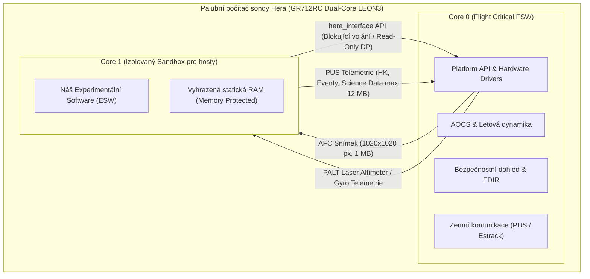

# ⚙️ 01. Technické mantinely, architektura a hardwarová analogie

Tento dokument detailně popisuje hardwarové a softwarové prostředí palubního počítače sondy ESA Hera, omezení běhového prostředí (sandboxu), limity paměti a telemetrie, a uvádí srovnání s běžným spotřebním a vývojovým hardwarem.

---

## 1. Architektura palubního počítače (OBC)

Sonda Hera využívá palubní počítač postavený na evropském dvoujádrovém procesoru **Cobham / Frontgrade Gaisler GR712RC**:

- **Instrukční sada:** 32-bit SPARC V8 (LEON3 dual-core).
- **Takt procesoru:** cca **50 až 100 MHz** (cca 70 až 140 DMIPS na jádro).
- **Hardwarová FPU:** Jednoduchá IEEE-754 plovoucí řádová čárka.
- **Dělení úloh mezi jádry:**
  - **Core 0 (Flight Critical):** Běží primární letový software mise Hera, AOCS (Attitude & Orbit Control System), FDIR (Failure Detection, Isolation and Recovery) a komunikace se Zemí.
  - **Core 1 (Guest Sandbox):** Vyhrazeno pro běh cizího experimentálního softwaru (**ESW – Experimental Software**).

---

## 2. Hardwarové a softwarové mantinely (Do čeho se musíme vejít)

| Oblast | Požadavek / Omezení | Důsledek pro vývoj |
| :--- | :--- | :--- |
| **Operační systém** | **Žádný (Bare-metal)** | Žádný Linux, žádný RTEMS, žádný POSIX, žádné systémové volání (`syscalls`). Software je čistá C smyčka. |
| **Správa paměti** | **Zákaz dynamické alokace (`malloc`/`free`)** | Všechny buffery, tabulky a datové struktury musí být buď staticky alokované v globální paměti, nebo v pevném pool alokátoru inicializovaném při startu. |
| **Memory Protection** | **Striktní hardwarové hranice RAM** | Jakýkoliv pokus o přístup mimo vymezený rozsah RAM Core 1 nebo zápis do registrů způsobí okamžité hardwarové sestřelení programu. |
| **Velikost zásobníku (Stack)** | **64 KB** (inicializace na `0x40010000`) | Zákaz velkých lokálních polí na stacku; matice a buffery musí být `static` nebo globální. |
| **Jazyk a kompilátor** | **Čisté C (C99/ANSI C)** | Kompilace pomocí `sparc-gaisler-elf-gcc` (BCC 4.4.2 1.0.52). Přísné dodržování **MISRA-C** pravidel. |
| **Knihovny** | **Žádné externí knihovny** | Povolena je pouze matematická knihovna ESA `LibmCS`. |
| **Časový profil běhu** | **2 až 3 hodiny denně** | Software neběží trvale. Musí být schopen nastartovat, provést výpočet, odeslat data a ukončit se v rámci jednoho slotu. |
| **Okamžitá přerušitelnost** | **Bezpečný pád při Safe Mode** | Pokud Core 0 detekuje anomálii na sondě, Core 1 okamžitě vypne. Kód nesmí spoléhat na gracefully shutdown a musí být bezstavový (stateless). |

---

## 3. Rozhraní, senzory a limity telemetrie (Platform API)

Všechny I/O operace probíhají výhradně přes rozhraní [`hera_interface.h`](file:///c:/Users/vikto/Disk%20Google/Radixal/Zakázky/2026_026%20Hera%20Space%20Probe%20Code%20Contest/podklady/simulation_layer/esw_interface/hera_interface.h):

### A. Senzory a kamery sondy
1. **AFC (Asteroid Framing Camera):**
   - Senzor: FaintStar2 CMOS, rozlišení **1020 × 1020 pixelů**, 8-bit monochromatický (1 040 400 bytů).
   - Volání: `Hera_AFC_AcquireSingleImage(exp_us)` (blokuje cca 7 s + expozice).
   - Čtení dat: `Hera_AFC_GetImageBuffer()` vrátí přímý ukazatel `uint8*` do paměti RAM na snímek pro zpracování.
   - Uložení pro downlink: `Hera_AFC_StoreImage()` (blokuje 10 s, zkopíruje do Mass Memory).
2. **PALT (Planetary Altimeter - Laserový dálkoměr):**
   - Měří vzdálenost k povrchu (10 m až 20 000 m, rozlišení 0,1 m).
   - Data jsou k dispozici v Mission Data Poolu (obnova každé 2 s) přes `Hera_Read_Parameter_float64()`.
3. **TIRI (termální kamera 1024×768) a HyperScout (hyperspektrální 2048×1088):**
   - ESW může iniciovat pořízení snímku, data však jdou přímo do Mass Memory (nejsou přímo v RAM Core 1 pro palubní analýzu).

### B. Výstupní telemetrie a downlink (PUS standard)
- **Housekeeping (PUS Service 3):** Max. **256 bytů** na paket, minimální interval mezi reporty **5 minut**. Slouží pro sledování stavu, čítačů a režimů.
- **Event Reporting (PUS Service 5):** Max. **50 bytů** na paket, minimální interval **20 sekund**. Pouze úrovně *Informational* a *Warning*.
- **Science Data Telemetry:** Max. **2048 bytů** na paket, celkový objem za 3hodinové okno je **max. 12 MB**.

---

## 4. Hardwarová analogie (K čemu to přirovnat a na čem ladit)

### Přirovnání ke spotřební a vývojové elektronice:
- ❌ **Není to tablet, smartphone ani notebook:** Běžný mobil či notebook disponuje 8–32 GB RAM, 8–16 jádry na 3–4 GHz a dedikovaným AI akcelerátorem (NPU/GPU) – je **10 000× až 100 000× výkonnější**.
- 🕰️ **Historická paralela:** Výkonově a paměťově odpovídá stolnímu PC s procesorem **Intel Pentium 75–100 MHz z roku 1995**, kapesnímu PDA z roku 2000 nebo herní konzoli **Nintendo DS** (ARM9 @ 67 MHz + 4 MB RAM) / **PlayStation 1** (MIPS @ 33 MHz + 2 MB RAM).
- 🛠️ **Moderní ekvivalent na vývojářském stole:** Střední mikrokontrolér (MCU):
  - **Raspberry Pi Pico (RP2040):** Dvoujádrový ARM Cortex-M0+ @ 133 MHz, 264 KB SRAM.
  - **STM32F4 (Nucleo-F401RE / F411RE):** ARM Cortex-M4 @ 84–100 MHz s FPU, 128–192 KB RAM, 512 KB Flash.

### Vývojový a ladicí přístup:
1. **Algoritmická úroveň (PC / Python):** Návrh a ladění matematiky, trénování TinyML modelů v Pythonu (PyTorch, OpenCV) na reálném datasetu `AFC_images.tar.gz`.
2. **Implementační úroveň (ANSI / MISRA-C):** Přepis do C s pevnou řádovou čárkou / INT8 kvantizací bez `malloc`.
3. **Cílová emulace (QEMU LEON3):** Běh výsledného ELF binárního souboru v emulátoru `qemu-system-sparc -M leon3_generic -kernel hera_test.elf`, což přesně simuluje časování a paměťové chování sondy.
